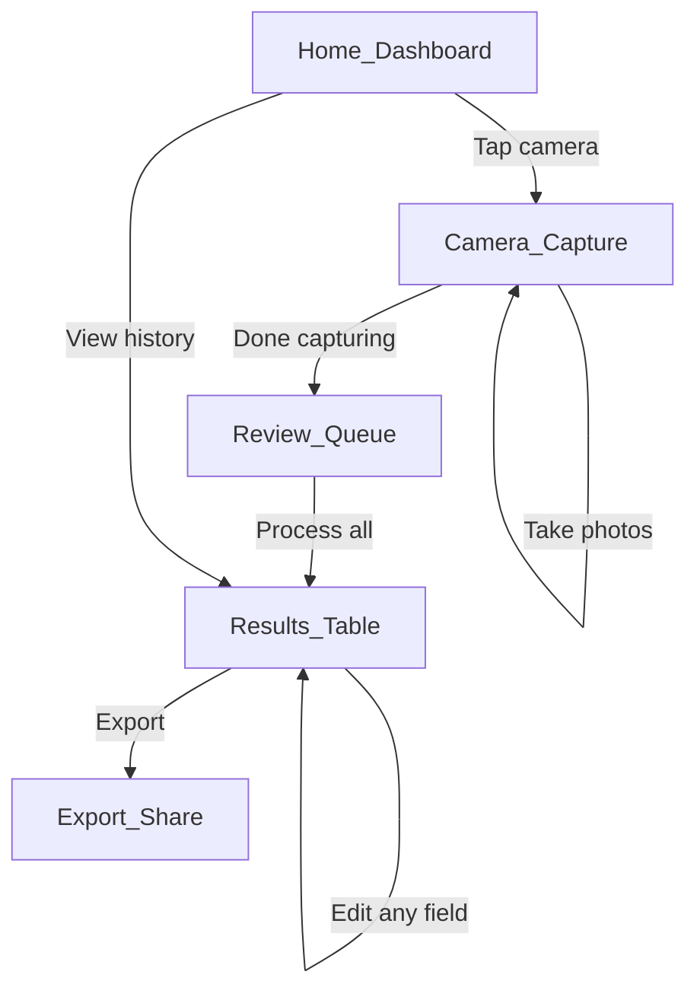
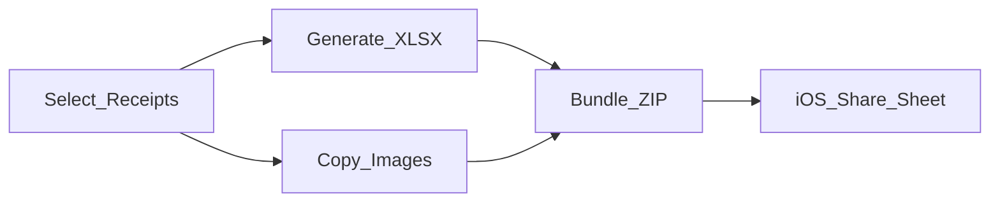

# Receipt Scanner App — Architecture Plan

## Distribution Strategy

**Expo Go** — the other person installs the free [Expo Go](https://apps.apple.com/app/expo-go/id982107779) app from the App Store. Your app runs inside it.

- **How it works**: You publish your JS bundle via `eas update` (free tier). They open Expo Go, scan a QR code or tap a link, and your app loads. No Apple Developer account needed, no signing, no expiry.
- **Camera quality**: `expo-camera` inside Expo Go uses the same native `AVCaptureSession` as a standalone build — full resolution, autofocus, flash, zoom. No degradation.
- **Updates**: You push code changes via `eas update`. Next time they open the app, it auto-downloads the latest version. Zero friction, no USB needed.
- **Tradeoffs**: The home screen icon says "Expo Go" (not your app name). Shaking the phone opens a dev menu (they can ignore it). No custom splash screen. These are cosmetic only.
- **Cost**: $0 — completely free, no expiry, no re-signing.

---

## Tech Stack


| Layer | Choice | Why |
| ----- | ------ | --- |


- **Framework**: React Native 0.81 + Expo SDK 54 — Expo simplifies builds and native module access
- **Language**: TypeScript (strict mode)
- **Routing**: Expo Router v6 — file-based routing with typed routes
- **Styling**: NativeWind v4 (Tailwind CSS for React Native) — light mode only
- **Typography**: DM Sans (geometric sans-serif via `@expo-google-fonts/dm-sans`) — Regular, Medium, Bold
- **Color palette**: Deep navy (`#1B2541`) + burnished copper (`#C27C4E`) on warm ivory (`#FAF8F5`)
- **Camera**: `expo-camera` — rapid-fire receipt capture with preview
- **LLM**: Google Gemini 2.0 Flash (free tier) — best free vision model; 1,500 requests/day, 15 RPM
- **Local Storage**: `expo-sqlite` for structured data + `expo-file-system` for receipt images
- **Excel Export**: `xlsx` (SheetJS) library for .xlsx generation
- **Zip/Bundle**: `jszip` for bundling spreadsheet + images
- **Sharing**: `expo-sharing` to invoke the iOS share sheet

---

## LLM Choice: Google Gemini 2.0 Flash (Free Tier)

**Why Gemini over alternatives:**

- **Free tier**: 1,500 requests/day, 15 requests/minute — more than enough for one person
- **Vision-native**: Send receipt images directly, no OCR preprocessing needed
- **Structured output**: Gemini supports JSON mode, so we get clean parsed data back
- **Accuracy**: Gemini 2.0 Flash is strong at document/receipt understanding

**API Integration Pattern:**

- Send base64 receipt image + a system prompt describing the desired JSON schema
- Gemini returns structured JSON with: `total`, `date`, `vendor`, `description`, `currency`, `lineItems` (optional)
- API key embedded in app (acceptable since only 1-2 trusted users)

**Prompt design** (critical for accuracy):

```
You are a receipt parser. Analyze this receipt image and extract:
- total_amount (number, the final total paid)
- currency (e.g. "USD", "CAD")  
- date (ISO 8601 format, e.g. "2026-02-12")
- vendor_name (business name)
- description (1-2 sentence summary of what was purchased)
- category (your best guess: meals, travel, office supplies, entertainment, etc.)
- confidence (low/medium/high — how confident you are in the extraction)

Return ONLY valid JSON. If a field cannot be determined, use null.
```

---

## Data Model

Defined in `types/receipt.ts`. Stored in `expo-sqlite` (`burse.db`) for queryability. Images stored in `expo-file-system` document directory under `receipts/`.

```typescript
type ReceiptStatus = 'pending' | 'processing' | 'done' | 'error';
type ConfidenceLevel = 'low' | 'medium' | 'high';

interface Receipt {
  id: string;                   // UUID
  imageUri: string;             // local file path to the receipt photo
  totalAmount: number | null;
  currency: string | null;
  date: string | null;          // ISO 8601
  vendorName: string | null;
  description: string | null;
  category: string | null;
  confidence: ConfidenceLevel;
  status: ReceiptStatus;
  createdAt: string;            // when photo was taken
  errorMessage: string | null;  // null, not optional — 1:1 SQLite column mapping
}
```

CRUD operations in `lib/database.ts`. Image storage in `lib/storage.ts` (uses SDK 54 class-based `Paths`/`File`/`Directory` API).

---

## UX Flow (5 screens)




### Screen 1: Home / Dashboard

- Shows count of receipts processed, quick stats
- Big "Scan Receipts" button
- "View All Receipts" to see history

### Screen 2: Camera Capture (optimized for speed)

- Full-screen camera with large shutter button
- **Rapid-fire mode**: tap to capture, immediately ready for next shot (no review delay)
- Running count badge: "4 captured"
- "Done" button when finished capturing

### Screen 3: Review Queue

- Thumbnail grid of all captured photos
- Swipe to delete bad photos
- "Process All" button sends everything to Gemini
- Progress indicator showing per-receipt status

### Screen 4: Results Table (main workhorse screen)

- Scrollable table/list showing all receipts with extracted data
- **Tap any field to edit** (inline editing)
- Color-coded confidence (green=high, yellow=medium, red=low)
- Checkbox to select/deselect receipts for export
- Tap thumbnail to view full receipt image
- Filter by date range, status

### Screen 5: Export / Share

- Choose format: Excel (.xlsx) or CSV
- Toggle: "Include receipt images" (bundles as .zip)
- Preview of what will be exported
- "Share" button opens iOS share sheet (AirDrop, Mail, Files, etc.)

---

## Export Flow




1. User selects receipts to export (or "select all")
2. Generate `.xlsx` with columns: Date, Vendor, Description, Category, Amount, Currency
3. If images included: copy receipt photos, renamed to match row numbers (e.g., `receipt_001.jpg`)
4. Bundle spreadsheet + images folder into a `.zip` using JSZip
5. Save zip to temp directory, open iOS share sheet via `expo-sharing`

---

## Project Structure

```
burse/
  app/                      # Expo Router file-based routing
    _layout.tsx             # Root Stack layout (font loading, splash screen)
    (tabs)/
      _layout.tsx           # Bottom tab navigator (Home + Receipts)
      index.tsx             # Home / Dashboard
      history.tsx           # Results table (all receipts)
    camera.tsx              # Camera capture screen (full-screen modal)
    review.tsx              # Review queue before processing
    export.tsx              # Export configuration & share
  components/
    ReceiptCard.tsx         # Receipt display card
    EditableField.tsx       # Inline-editable text field
    ConfidenceBadge.tsx     # Color-coded confidence indicator
  lib/
    gemini.ts               # Gemini API client
    database.ts             # SQLite setup & queries
    export.ts               # XLSX generation + ZIP bundling
    storage.ts              # Image file management
  constants/
    prompts.ts              # LLM prompt templates
  types/
    receipt.ts              # TypeScript interfaces
  global.css                # Tailwind directives (@tailwind base/components/utilities)
  tailwind.config.js        # NativeWind config: custom colors, fonts
  babel.config.js           # Babel config with NativeWind preset
  metro.config.js           # Metro bundler config with NativeWind
  nativewind-env.d.ts       # TypeScript types for className prop
  app.json                  # Expo config
  package.json
```

---

## Key Design Decisions Summary

1. **Expo over bare React Native** — drastically simplifies camera, file system, sharing, and build/install
2. **Google Gemini 2.0 Flash** — only viable free vision API with sufficient quality and generous limits
3. **SQLite over AsyncStorage** — receipts are tabular data; SQL makes filtering/sorting/querying trivial
4. **Process in parallel** — send all receipt images to Gemini concurrently (respecting 15 RPM limit) for speed
5. **ZIP export with images** — spreadsheet + named image files is the most universally useful format for reimbursement
6. **Inline editing** — the LLM will occasionally get things wrong; fast inline correction keeps the flow smooth
7. **No backend server** — API key embedded in app, everything local, zero infrastructure cost
8. **Expo Router** — file-based routing is the modern Expo standard, simple and clean
9. **NativeWind (Tailwind CSS)** — utility-first styling for consistent, rapid UI development across all screens
10. **DM Sans typography** — geometric sans-serif font (Regular/Medium/Bold) for a modern minimalist luxury feel
11. **Navy + Copper palette** — distinctive luxurious color scheme; copper CTAs, navy structure, warm ivory backgrounds

---

## Dependencies (as installed)

```json
{
  "expo": "~54.0.33",
  "expo-camera": "installed via npx expo install (SDK 54 compatible)",
  "expo-file-system": "installed via npx expo install (SDK 54 compatible)",
  "expo-sharing": "installed via npx expo install (SDK 54 compatible)",
  "expo-sqlite": "installed via npx expo install (SDK 54 compatible)",
  "expo-image-manipulator": "installed via npx expo install (SDK 54 compatible)",
  "expo-font": "~14.0.11",
  "expo-splash-screen": "~31.0.13",
  "@expo-google-fonts/dm-sans": "latest",
  "nativewind": "latest",
  "tailwindcss": "^3.4.17",
  "xlsx": "latest",
  "jszip": "latest",
  "@google/generative-ai": "latest",
  "uuid": "latest"
}
```

---

## Risks & Mitigations

- **Gemini accuracy on crumpled/faded receipts**: Mitigated by showing confidence scores and allowing edits
- **Free tier rate limits (15 RPM)**: Mitigated by queuing with throttling; for 20 receipts, takes ~90 seconds
- **Expo Go cosmetic limitations**: Minor — no custom app icon or splash screen, but functionally identical to standalone
- **Large images eating Gemini tokens**: Mitigated by resizing images to ~1024px before sending (via `expo-image-manipulator`)

